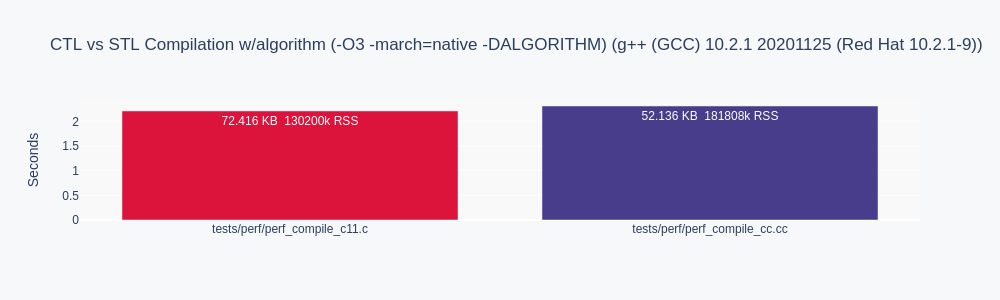

# algorithm - CTL - C Container Template library

Defined in header **<ctl_algorithm.h>**, which is currently always included for all containers.

## SYNOPSIS

    #include <ctl_deque.h>
    int int_is_odd(int* a) {
       return *a % 2;
    }

    deq_int a = deq_int_init ();
    deq_int_resize (&a, 100);
    for (int i=0; i<100; i++)
      deq_int_push_front (&a, rand());

    printf ("%zu odd members in deque\n",
      deq_int_count_if (&a, is_odd));

    deq_int_free(&a);

## DESCRIPTION

The algorithms library implements functions for a variety of purposes
(e.g. searching, sorting, counting, manipulating) that operate on all or on
ranges of elements via generic iterators. Note that a range is defined as
`[first, last)` where last refers to the element past the last element to
inspect or modify.
range variants are specified with the `_range` suffix, without they operate on
all elements on the container.

There are no execution policies yet, but I am planning a **pctl**,
i.e. `parallel_policy` and `parallel_unsequenced_policy`
for various backends like openmp or TBB.

unordered_set does not support ranges, nor count functions ending with `_n`.
Such iterators on `unordered_set` make not much sense, as the order is random.

All ranges in 2nd argument positions support generic iterators, i.e. `GI*` ranges,
with the same value type, but any container types.

## Member types

`T`     value type

`A`     container type

`I`     iterator type for A

`GI`    generic iterator type for all containers.

## Non-modifying sequence operations

    bool all_of (A* self, int _match(T*)) (C++11)
    bool any_of `(A* self, int _match(T*)) (C++11)
    bool none_of (A* self, int _match(T*)) (C++11)
    bool all_of_range (I* range, int _match(T*))
    bool any_of_range (I* range, int _match(T*))
    bool none_of_range (I* range, int _match(T*))

checks if a predicate is true for all, any or none of the elements in a range

    foreach (A, self, iter) {...}
    foreach_range (A, iter, first, last) {...}
    foreach_range_ (A, iter, range) {...}

applies a block to a range of elements with iter.

    foreach_n (A, self, n) {...} (C++17)
    foreach_n_range (A, first, n) {...}

applies a block with iter to the first n elements of a sequence.

    size_t count (A* self, T value)
    size_t count_if (A* self, int _match(T*))
    size_t count_range (I* range, T value)
    size_t count_if_range (I* range, int _match(T*))

returns the number of elements satisfying specific criteria.

    bool mismatch (I* range1, GI* range2)

finds if and the first position where two ranges differ.

    I find (A* self, T* value)
    I find_if (A* self, int _match(T*))
    I find_if_not (A* self, int _match(T*)) (C++11)
    bool find_range (I* range, T value)
    I find_if_range (I* range, int _match(T*))
    I find_if_not_range (I* range, int _match(T*))

finds the first element satisfying specific criteria.
Either return a fresh iterator I, or return bool and set the range argument to the found element.
Does not consume/free the T value.

    I find_end (A* self, GI* range2)
    I find_end_range (I* range1, GI* range2)

finds the last sequence of elements in a certain range.

    I find_first_of (A* self, GI* range2)
    bool find_first_of_range (I* range1, GI* range2)

searches for any one of a set of elements.

    I  adjacent_find (A* self)
    I* adjacent_find_range (I* range)

finds the first two adjacent items that are equal.

    I search (A* self, I* range2)
    bool search_range (I* range1, GI *range2)
    I bm_search (A* self, GI* range2)  (C++17) (NYI)
    bool bm_search_range (I* range1, GI *range2)  (C++17) (NYI)

searches for a range of elements. naive cost `range1` * `range2`.
`search_range` sets `range1` (the haystack) to the found pointer if found.
`search` returns an iterator to the pointer if found, or end.
planned are also boyer-moore, boyer-moore-horspool, kmp and rabin-karp.

    I* search_n (A *self, size_t count, T value)
    I search_n_range (I *range, size_t count, T value)

searches a range for a number of consecutive copies of an element.

## Modifying sequence operations

    copy
    copy_if (C++11)
    A* copy_range (I* range, A* out)
    copy_if_range

copies a range of elements to the end of another container.

    copy_n (C++11)
    copy_n_range

copies a number of elements to a new location. _(NYI)_

    copy_backward

copies a range of elements in backwards order. _(NYI)_

    I* move (I* range, I* out) (C++11)

moves a range of elements to the end of a new container.

    move_backward (C++11)

moves a range of elements to a new location in backwards order. _(NYI)_

    fill
    fill_range

copy-assigns the given value to every element in a range. _(NYI)_
assigns a range of elements a certain value.

    fill_n
    fill_n_range

copy-assigns the given value to N elements in a range. _(NYI)_
assigns a value to a number of elements

    A transform (A* self, T unop(T*))
    A transform_it (A* self, I* pos, T _binop(T*, T*))
    I transform_range (I* range1, I dest, T _unop(T*)) (NY)
    I transform_it_range (I* range1, I* pos, I dest,
                          T _binop(T*, T*))

applies a function to a range of elements. Returning results in a copy, or for
the range variants in an output iterator `dest`.  unop takes the iterator
element, binop takes as 2nd argument the 2nd iterator `pos`.

    generate (A* self, T _gen(void))
    generate_range (I* range, T _gen(void))

assigns the results of successive function calls to every element in a
range.

    generate_n (A* self, size_t count, T _gen(void))
    generate_n_range (I* first, size_t n, T _gen(void)) (NY)

assigns the results of successive function calls to N elements in a range.
Note that the spec deviates sometimes from the STL.

    size_t remove (A* self, T value)
    size_t remove_if (A* self, int _match(T*)
    remove_range
    remove_if_range

removes elements satisfying specific criteria. (_Partially implemented)_

    remove_copy
    remove_copy_if
    remove_copy_range
    remove_copy_if_range

copies a range of elements omitting those that satisfy specific criteria. _(NYI)_

    replace
    replace_if
    replace_range
    replace_if_range

replaces all values satisfying specific criteria with another value. _(NYI)_

    replace_copy
    replace_copy_if
    replace_copy_range
    replace_copy_if_range

copies a range, replacing elements satisfying specific criteria with another value. _(NYI)_

    swap (A* self, A* other)

swaps the values of two objects.

    swap_ranges

swaps two ranges of elements. _(NYI)_

    iter_swap

swaps the elements pointed to by two iterators. _(NYI)_

    reverse (A* self)
    reverse_range

reverses the order of elements in a range. _(range NYI)_

    reverse_copy
    reverse_copy_range

creates a copy of a range that is reversed. _(NYI)_

    rotate
    rotate_range

rotates the order of elements in a range. _(NYI)_

    rotate_copy
    rotate_copy_range

copies and rotate a range of elements. _(NYI)_

    shift_left
    shift_right

shifts elements in a range. _(NYI)_

    shuffle (A* self)
    shuffle_range (I* range)

randomly re-orders elements in a range, via rand() and slow value swap.

    sample (C++17)
    sample_range

selects n random elements from a sequence. _(NYI)_

    I unique (A* self)
    I unique_range (I* range)

removes consecutive duplicate elements in a range.

    unique_copy
    unique_copy_range

creates a copy of some range of elements that contains no consecutive duplicates. _(NYI)_

## Partitioning operations

    is_partitioned (C++11)
    is_partitioned_range

determines if the range is partitioned by the given predicate. _(NYI)_

    partition
    partition_range

divides a range of elements into two groups. _(NYI)_

    partition_copy (C++11)
    partition_copy_range

copies a range dividing the elements into two groups. _(NYI)_

    stable_partition
    stable_partition_range

divides elements into two groups while preserving their relative order. _(NYI)_

    partition_point (C++11)
    partition_point_range

locates the partition point of a partitioned range. _(NYI)_

## Sorting operations

    bool is_sorted (C++11)
    bool is_sorted_range

checks whether a range is sorted into ascending order. _(NYI)_

    bool is_sorted_until (C++11)
    bool is_sorted_until_range

finds the largest sorted subrange. _(NYI)_

    sort (A* self)
    sort_range (I* range)

sorts a range into ascending order.

    partial_sort
    partial_sort_range

sorts the first N elements of a range. _(NYI)_

    partial_sort_copy
    partial_sort_copy_range

copies and partially sorts a range of elements. _(NYI)_

    stable_sort
    stable_sort_range

sorts a range of elements while preserving order between equal elements. _(NYI)_

    nth_element
    nth_element_range

partially sorts the given range making sure that it is partitioned by the given element. _(NYI)_

## Binary search operations (on sorted ranges)

    I lower_bound (A* self, T value)
    I lower_bound_range (I* range, T value)

returns an iterator to the first element not less than the given value.

    I upper_bound (A* self, T value)
    I upper_bound_range (I* range, T value)

returns an iterator to the first element greater than a certain value.

    bool binary_search (A* self, T value)
    bool binary_search_range (I* range, T value)

determines if an element exists in a sorted sequence.

## Other operations on sorted ranges

    A merge (A* self, A* other)
    A merge_range  (I* range1, GI* range2)

merges the 2nd container into the first.

    inplace_merge (I *first, I *middle, I *last)

merges two ordered ranges in-place. _(NYI)_

## Set operations (on sorted ranges)

    bool includes (A* self, A* subseq)
    bool includes_range (I* range1, GI* subrange)

returns true if one sorted sequence is a sorted subsequence of another.

    A difference (A* self, A* other)
    A difference_range (I* range1, I* range2)

computes the difference between two ordered ranges.
Warning: Fails with 3-way compare! And with generic `range2` also.

    A intersection (A* self, A* other)
    A intersection_range (I* range1, GI* range2)

computes the intersection of two ordered ranges.

    A symmetric_difference (A* self, A* other)
    A symmetric_difference_range (I* range1, GI* range2)

computes the symmetric difference between two ordered ranges.

    A union (A* self, A* other)
    A union_range (I* range1, GI* range2)

computes the union of two sets or ordered ranges.

## Heap operations

    bool is_heap (C++11)
    bool is_heap_range

checks if the given range is a max heap. _(NYI)_

    bool is_heap_until (C++11)
    bool is_heap_until_range

finds the largest subrange that is a max heap. _(NYI)_

    make_heap
    make_heap_range

creates a max heap out of a range of elements. _(NYI)_

    push_heap
    push_heap_range

adds an element to a max heap. _(NYI)_

    pop_heap
    pop_heap_range

removes the largest element from a max heap. _(NYI)_

    sort_heap
    sort_heap_range

turns a max heap into a range of elements sorted in ascending order. _(NYI)_

# Minimum/maximum operations

    T max
    T max_range

returns the greater of the given values. _(NYI)_

    T max_element
    T max_element_range

returns the largest element in a range. _(NYI)_

    T min
    T min_range

returns the smaller of the given values. _(NYI)_

    T min_element
    T min_element_range

returns the smallest element in a range. _(NYI)_

    T minmax (C++11)
    T minmax_range

returns the smaller and larger of two elements. _(NYI)_

    T minmax_element (C++11)
    T minmax_element_range

returns the smallest and the largest elements in a range. _(NYI)_

    clamp (C++17)
    clamp_range

clamps a value between a pair of boundary values. _(NYI)_

## Comparison operations

    int equal (A* self, A* other)

determines if two sets of elements are the same.

    bool equal_value (I* range, T key)
    bool equal_range (I* range1, GI* range2)

returns true if all elements match a specific key, or all other elements.
Note: `equal_range` for `set` has a different API and functionality.

    bool lexicographical_compare (I* range1, GI* range2)

returns true if one range is lexicographically less than another.

## Permutation operations

    bool is_permutation (C++11)
    bool is_permutation_range

determines if a sequence is a permutation of another sequence. _(NYI)_

    next_permutation
    next_permutation_range

generates the next greater lexicographic permutation of a range of elements. _(NYI)_

    prev_permutation
    prev_permutation_range

generates the next smaller lexicographic permutation of a range of elements. _(NYI)_

## Numeric operations

See [numeric](numeric.md)

## Operations on uninitialized memory

See [memory](memory.md)

## PERFORMANCE

C is rougly comparable to C++ with algorithm included. But note that most of the
C++ functions are dynaloaded from `libstdc++.so.6`, whilst the C versions are directly in the binary.
(Only used are count and sort for all container).

* 40% less compiler memory used
* 4-5% faster execution
* 30% bigger executable

